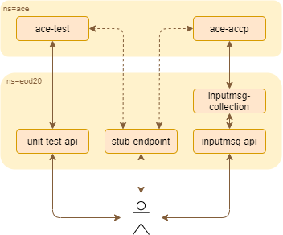
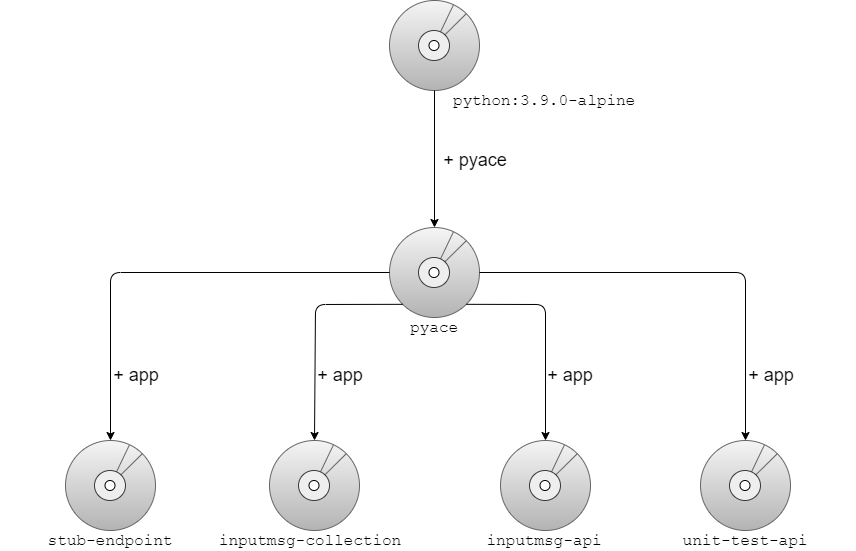
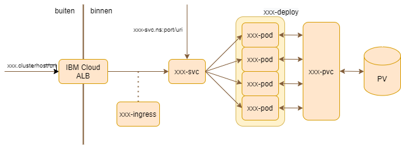

# IBM ACEv11 Flow Exercising as a Service

## Inleiding en motivatie
Haast alle (geautomatiseerde) unit-tests van ACE projecten betreffen slechts vergelijkingen van de input- en outputberichten van de hele flow. De "unit" in dit geval is dus een hele messageflow: erg ruim voor een unit. Echter ondergaat een bericht in transit verschillende tussenstappen, langs de nodes van een messageflow. Ook deze tussenstappen in ACE zijn te bekijken (middels de ACE Admini REST API), en in het verlengde kun je hiermee dus ook tests afnemen. Dit resulteert in fijngekorrelde unit-tests.

Deze repository bevat een set Kubernetes-native componenten en API's in Python die integreren met deze ACE Admin REST API en elkaar om zo een platform aan te bieden voor het API-matig verkrijgen van velddata op elk mogelijke tussenstap die het bericht onderging in een ACE flow. Omdat het een opzet in API's betreft, is hier in elke mogelijke taal mee te integreren in de vorm van scripting, client classes, enz. 

Key selling points:
- Gebouwd met het cutting edge technologie: Kubernetes-native en integratie met ACE 
- Staat tests toe op velddata op elk punt in de messageflow
- Opzet in API's biedt ruime integratiemogelijkheid
- Herbruikbare code en classes in Python package voor beheer en versionering.

## ACE Flow Exerciser & Test Records
De meest prominente functionaliteit waarvan in dit project extensief gebruikt wordt gemaakt is de mogelijkheid tot het API-matig integreren met wat we in de toolkit kennen als de Flow Exerciser. Je ziet na het exercisen van een bericht langs welke connecties (pijltjes) het bericht is gekomen en je kunt de vier root trees (message, LocalEnvironment, Environment en ExceptionList) bekijken.

### Flow recording en injecting
Het recorden zet je per messageflow aan, en om een bericht te kunnen exercisen kan behalve het van buiten aanroepen, ook injection aangezet worden. Uiteindelijk worden de test records opgehaald en verwijderd. Het voordeel van injection t.o.v. het van buiten inbrengen van het bericht is dat injection invariant is onder het type input node en dus het benaderprotocol (HTTP/MQ/enz).

> ```POST /apiv2/{project_type}/{project_name}/messageflows/{messageflow_name}/start-recording```

> ```POST /apiv2/{project_type}/{project_name}/messageflows/{messageflow_name}/stop-recording```

> ```POST /apiv2/{project_type}/{project_name}/messageflows/{messageflow_name}/start-injection```

> ```POST /apiv2/{project_type}/{project_name}/messageflows/{messageflow_name}/stop-injection```

> ```GET /apiv2/data/recorded-test-data```

> ```DELETE /apiv2/data/recorded-test-data```

### Test records
De test records die hieruit volgen zien er als volgt uit
```json
{
        "checkpoint": {
            "messageFlowData": {
                "integrationServer": "LOCALSERVER",
                "application": "FICO27_B2BInvoice_Demo",
                "isDefaultApplication": False,
                "library": "",
                "messageFlow": "FICO27_B2BInvoice",
                "threadId": 12300,
                "nodes": {
                    "propagationType": "terminal",
                    "source": {
                        "name": "HTTP Input",
                        "identifier": "FICO27_B2BInvoice#FCMComposite_1_1",
                        "type": "ComIbmWSInputNode",
                        "terminal": "out",
                        "inputNode": true
                    },
                    "target": {
                        "name": "RequestMapping",
                        "identifier": "FICO27_B2BInvoice#FCMComposite_1_2",
                        "type": "ComIbmComputeNode",
                        "terminal": "in"
                    }
                }
            },
            "sequenceData": {
                "serverSequenceNumber": 1,
                "flowSequenceNumber": 1,
                "threadSequenceNumber": 1,
                "connectionSequenceNumber": 1,
                "timestamp": "2020-11-22 12:40:57.508999"
            },
            "correlationData": {
                "invocationUUID": "f1f18e12-f07d-4a10-b2d1-966de4588911",
                "inputMessageUUID": "f1f18e12-f07d-4a10-b2d1-966de4588911"
            }
        },
        "testData": {
            "message": "PG1lc3NhZ...",
            "localEnvironment": "PGxvY2F...",
            "environment": "",
            "exceptionList": ""
        }
    }
```

En zoals je ziet, zit een record vol bruikbare info:
- Tussen welke twee terminals van welke nodes en in welke flow van welke applicatie en van welke server is dit record
- Sequence numbers zodat de volgorde van de connecties waarover het bericht ging bepaald kan worden
- Correlation data: invocationUUID is hetzelfde als inputMessageUUID als dit de eerste connectie was waar het bericht overheen ging.
- Base64 encoded IIB XML root trees (message, localEnvironment, Environment, exceptionList).

## Functionaliteit componenten


### inputmsg-collection
Een Kubernetes CronJob die je kunt configureren om naar een acceptatie-ACE te wijzen die elke keer:
1. Alle ACE records ophaalt en de input messages (invocationUUID = inputMessageUUID) laat opslaan via de inputmsg-api.
2. Haalt via de ACE Admin REST API alle draaiende projecten op en zet recording aan op al deze flows.

Beschouwbaar als een de component van een automatic message store die berichten op interval basis ophaalt. In de logs is te zien op welke interfaces en flows hij recording aan zet en hoe veel records doorgestuurd worden naar de inputmsg-api.

### inputmsg-api
Een API die dient als message store. Je kunt hier handmatig records heensturen, en de API zal alleen de input messages opslaan op disk (gescheiden per integration server, project type, project naam, messageflow en input node). De inputmsg-collection component stuurt hier ook de gevonden records heen.

> ```POST /``` om ACE records zoals hierboven beschreven te uploaden. De API zorgt zelf dat alleen de inputmessages (invocationUUID == inputMessageUUID) opgeslagen worden op disk (PV). Returncode ```201``` voor succesvolle aanmaak of ```204``` als er in de payload geen input messages zaten.

> ```GET /``` om ACE records op te halen. Specificeer collectie door parameters ```integration_server```, ```project```, ```message_flow``` en ```input_node``` in deze volgorde aanvullend te gebruiken. Elke parameter wordt alleen beschouwd als alle parameters daarvoor gevuld zijn. Zo wordt er bijvoorbeeld gefilterd op ```message_flow``` als de ```integration_server``` en ```project``` ook zijn aangeleverd. Timestamp slot kan gespecifieerd worden met ISO timestamp parameters ```from``` en ```to```. Returncode ```200```. Response body JSON is een dictionary met server-project-flow-node-timestamp structuur. Voorbeeld:
```json
{
    "SERVER": {
        "Project1": {
            "brokerschema.MsgFlow1": {
                "HTTP Input": {
                    "2020101715032678": {
                        "message": "PG1lc3NhZ...",
                        "localEnvironment": "PGxvY2F...",
                        "environment": "",
                        "exceptionList": ""
                    },
                    "2020101715045267": {
                        "message": "PG1lc3NhZ...",
                        "localEnvironment": "PGxvY2F...",
                        "environment": "",
                        "exceptionList": ""
                    }
                }
            }
        }
    }
}
```

Response van 

### stub-endpoint
Simpel API met een in-memory cache voor mock responses:
- mock id: zelf op te geven door de gebruiker.
- mock value: mock response als string.
De key is op te geven als parameter (```?id=```). Vergelijkbaar met een Redis instantie. Dit is handig als ACE backend services aan moet roepen die gemockt moeten worden. Operaties voor toevoegen/ophalen van mock responses, en het opschonen van de in-memory cache.

> ```POST /register?id=xxx``` om een mock response te registreren

> ```POST,GET,PUT,PATCH,DELETE /response?id=xxx``` om een mock response te laten uitgeven

> ```DELETE /``` om alle stubs op te schonen

### unit-test-api
Een API met een Query resource en een exerciser. 
- XPath queries kunnen worden aangemaakt en opgevraagd per project type, project naam, message flow naam, node en terminal.
- De exerciser slikt een testData JSON (zoals in de test records: met base64 encoded root trees) en inject dit in gespecificeerde input node van de input node van de messageflow. Recording wordt dan ingeschakeld. De records die terug komen worden gesorteert op sequence numbers en als de van/naar node en terminal matchen met de Query resource, wordt deze XPath uitgevoerd en het resultaat bewaard. De exerciser API geeft een object terug met info over de nodes en terminals die in volgorde worden geraakt, met per connectie de geraakte queries en de resultaten.

>```GET,POST,PUT /queries/{project_type}/{project}/{message_flow}/{node}/{terminal}``` om XPath queries te beheren die losgelaten worden op ACE records die voldoen aan de specificatie van ```project_type``` (altijd één uit ```applications```/```services```/```rest-apis```), ```project```, ```message_flow```, ```node``` en ```terminal```. Deze worden gecontroleerd op valide XPath syntax en bewaard op disk (PV) als ze voorheen niet bestonden (POST) of vervangen als ze reeds niet bestonden (PUT). Opmerking de vier root trees moeten, in tegenstelling tot in ESQL, in camelcase gebruikt worden :```localEnvironment``` bijvoorbeeld. Return code ```200```. Request body PUT/POST en response body GET:
```json
    {
        "inputmsg_booktitle": "//{tns}book//{tns}title",
        "backendresp_parsexc_bip": "//ParserException/BIP",
        "envvar_dummy": "//environment/Variables/Dummy",
        "invalid_xpath": "%^&*"
    }
```
Response body van POST/PUT:
```json
    {
        "inputmsg_booktitle": "created",
        "backendresp_parsexc_bip": "not created: already exists",
        "envvar_dummy": "not replaced: does not exist",
        "invalid_xpath": "invalid XPath expression"
    }
```
>```POST /exercise/{project_type}/{project}/{message_flow}/{node}``` om een bericht te exercisen door hem op de inputnode van de gespecificeerde flow te sturen. De API zorgt er dan voor dat ACE tijdelijk recording en injection aan heeft staan op die flow. Vervolgens worden de ACE records gesorteerd op ```flowSequenceNumber``` en wordt er per record gekeken of er Xpath queries zijn die matchen met of de source of de target node+terminal. Deze query resultaten worden dan ook teruggegeven. Request body: 
```json
{"testData":{
    "message": "PG1lc3NhZ...",
    "localEnvironment": "PGxvY2F...",
    "environment": "",
    "exceptionList": ""
}}
```
Response body: 
```json
[
    {
        "from": {
            "node": "HTTP Input",
            "terminal": "out"
        },
        "to": {
            "node": "BackendRequestMapping",
            "terminal": "in"           
        },
        "queries": {
            "inputmsg_booktitle": {
                "query":  "//{tns}book//{tns}title",
                "result": [
                    "Harry Potter and the Deathly Hallows",
                    "IIB voor Dummies",
                    "De memoires van Jasper Landa"
                ]
            },
            "envvar_dummy": {
                "query":  "//environment/Variables/Dummy",
                "result": [
                    "Dummyvalue"
                ]
            }
        }
    },
    {
        "from": {
            "node": "BackendRequestMapping",
            "terminal": "out"
        },
        "to": {
            "node": "BackendSOAPRequest",
            "terminal": "in"           
        },
        "queries": {
            "envvar_dummy": {
                "query":  "//Environment/Variables/Dummy",
                "result": [
                    "Dummyvalue"
                ]
            }
        }
    }, ...
]
```

### pyace
Dit is geen Kubernetes component maar een Python package (3.9.0 en hoger!) met classes en veelgebruikte functionaliteit
- ACEAdminConnection is een class, waarvan elke instance de host, port, en login op de ACE Admin bewaard wordt. Bevat enkele methodes om REST operaties uit te voeren op de ACE Admin REST API
- ACERecord is een class die het test record als dictionary opslaat, en die direct toegankelijke properties heeft voor de gangbare attributen: bron- en doelnode, bron- en doelterminal, flow sequence volgnummer, timestamp, etc.
- Een handige methode om bestandsinhoud in een directory recursief terug te geven in een path-content dictionary, met handige opties.

Van een Python 3.9.0 alpine image wordt een base image gemaakt waarop dit Python package voorgeïnstalleerd is, zodat child images (de images van de andere componenten) hiervan gebruik kunnen maken. 



## Kubernetes architectuur
De meeste componenten gebruiken de volgende Kubernetes opzet:



Dit geldt voor:
- ace-test en ace-accp (slechts één pod per test/accp deployment). Gebruikt geen PV en PVC (Persistent Volumes en Persistent Volume Claims).
- inputmsg-api.
- unit-test api.
- stub-endpoint, exclusief de PV en PVC.

Een uitleg voor de Kubernetes-leken:
- De Kubernetes pods bevatten de applicatie, hebben elk hun eigen IP (wat wisselt met het omvallen en herstarten van containers), en zijn onbereikaar van buitenaf.
- Een Kubernetes service is een object dat één IP heeft en poorten naar bepaalde pod poorten doorverwijzen. Zo zijn alle pods van een deployment intern bereikbaar met adres ```k8s_servicenaam.k8s_namespace:port```.
- Een Kubernetes ingress verbindt een subdomein en eventueel uri prefixes met een kubernetes service. Zo kun je elegant je service benaderen met ```subdomain.cloudhostname.com/uri```. Gebruik hiervan is afhankelijk van de ingress controller die je cloud met zich meeneemt. 
- Een Kubernetes PVC (PersistentVolumeClaim) wordt aan een pod gebonden en zorgt dat er ruimte gereserveerd wordt op een PV (PersistenVolume). In het geval van de (IBM) cloud wordt er cloud block/file storage aangemaakt.

> *Opmerking: de IBM Cloud ingress controller biedt geen 'SSL passthrough', wat inhoudt dat de controller inkomend verkeer niet versleuteld kan doorsturen naar backend apps. Dit heet 'SSL termination'. Daarom zijn alle apps niet met HTTPS versleuteld, wat niet nodig is omdat het inkomend verkeer op de cloud ingress service wel versleuteld is en alles binnen Kubernetes onbereikbaar is van buiten.*


## Installatie
Alle Kubernetes resources kunnen gemakkelijk geïnstalleerd worden met de Helm chart:

### ACE test en accp server

#### Installatiestappen
1. Open de Helm chart values: ```helm/ace-test-accp/values.yaml``` en pas aan waar nodig (zie subsectie over de uitleg van de helm chart values) 
2. Creëer de namespace voor de componenten: ```kubectl create ns ace```
3. Installeer de Helm chart: ```helm install ace-unit-test-util .\helm\ace-test-accp\ -n ace```

#### Config (values.yaml)
```yaml
# FQDN of the IBM Cloud Kubernetes service cluster
ibmCloudKsHost: eod20-618dd4f5cf576582d05dea2fdbda72d6-0000.eu-de.containers.appdomain.cloud

# TLS secret of the Application Load Balancer (ALB). In case of the IBM Cloud KS, the secret name is the same as the host prefix
tlsSecret: eod20-618dd4f5cf576582d05dea2fdbda72d6-0000

# Docker server (+ namespace if applicable)
imageRepo: de.icr.io/landa

# Docker server image pull secret. Must be created in the same namespace before installing the chart!
imagePullSecret: icr

ingress:
  annotations:
    # Put ingress annotations here. These will be substituted into the annotations of all the ingresses in the chart
    ingress.bluemix.net/redirect-to-https: "True" # Redirect http to https

# For both test and accp, define the docker image tag of eod20-ace to be used to deploy the ACE server.  
aceTest:
  tag: latest
  
aceAccp:
  tag: latest
```

### Eindopdracht componenten

#### Installatiestappen
1. Open de Helm chart values: ```helm/ace-unit-test-util/values.yaml``` en pas aan waar nodig (zie subsectie over de uitleg van de helm chart values) 
2. Creëer de namespace voor de componenten: ```kubectl create ns eod20```
3. Installeer de Helm chart: ```helm install ace-unit-test-util .\helm\ace-unit-test-util\ -n eod20```

#### Config (values.yaml)
```yaml
ibmCloudKsHost: eod20-618dd4f5cf576582d05dea2fdbda72d6-0000.eu-de.containers.appdomain.cloud
tlsSecret: eod20-618dd4f5cf576582d05dea2fdbda72d6-0000

imageRepo: de.icr.io/landa

imagePullSecret: icr

ingress:
  annotations: 
    ingress.bluemix.net/redirect-to-https: "True"

# eod20-stub-endpoint docker image tag and replicas
stubEndpoint:
  tag: latest
  replicas: 1
 
# eod20-input-msg-api docker image tag, replicas, PVC class and size, and basic auth config
inputMsgApi:
  tag: latest
  replicas: 3
  storageClassName: ibmc-file-retain-gold
  storage: 3Gi
  auth:
    user1: pw1
    user2: pw2

# eod20-unit-test-api docker image tag, replicas, PVC class and size and basic auth config
unitTestApi:
  tag: latest
  replicas: 3
  storageClassName: ibmc-file-retain-gold
  storage: 3Gi
  auth:
    user1: pw1
    user2: pw2

# eod20-input-msg-collection docker image tag and cronjob schedule
inputMsgCollection:
  tag: latest
  schedule: "*/3 * * * *"

# for ACE test and accp, specify the cluster-internal addres (for ACE on K8s, this is always equal to <service_name>:<namespace>), port, and an ACE user+pw  
aceTest:
  host: ace-test-svc.ace
  port: "7600"
  user: admin1
  pw: admin1
  
aceAccp:
  host: ace-accp-svc.ace
  port: "7600"
  user: admin1
  pw: admin1
```
